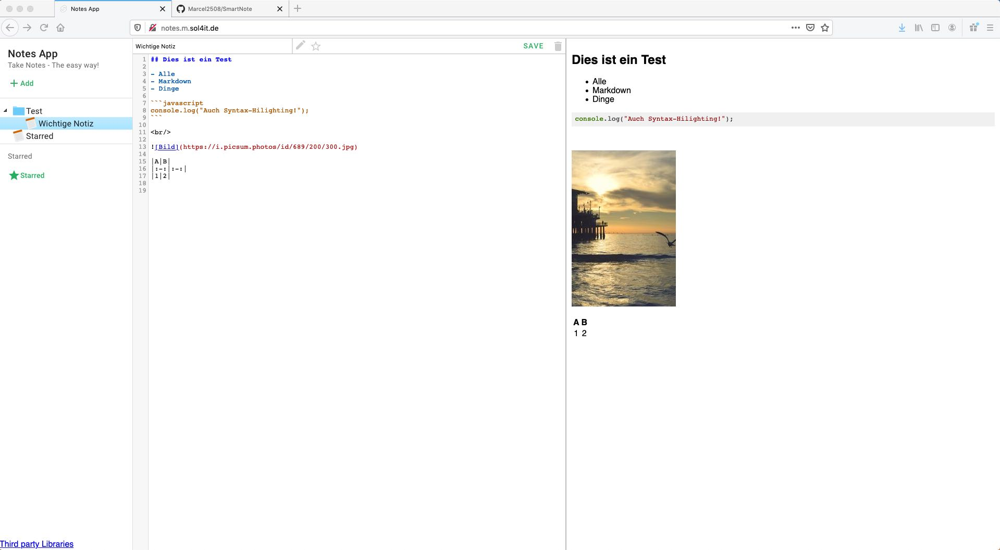

# Notes App

Eine Simple Software um Notizen zu machen.

Demo: [notes.m.sol4it.de](http://notes.m.sol4it.de/)


## Screenshots




<br/>

## Selbst hosten?

```bash
git clone https://github.com/Marcel2508/SmartNote.git smartnote
cd smartnote
docker-compose up -d
```